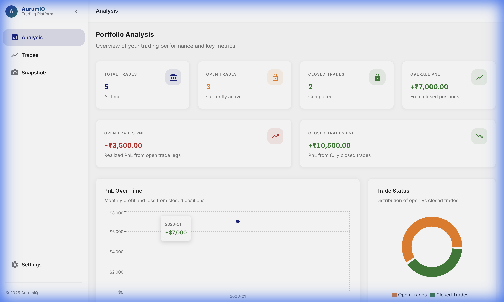
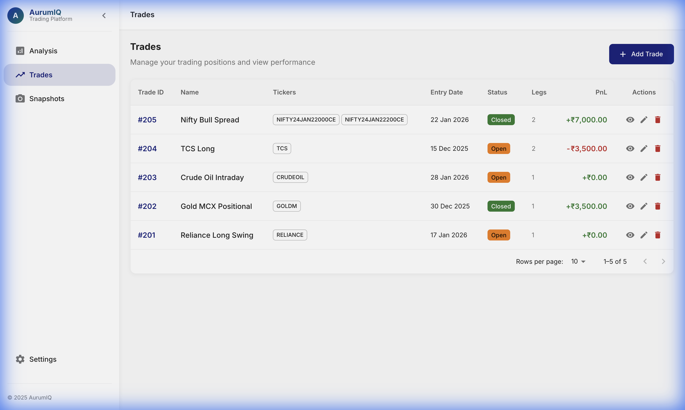
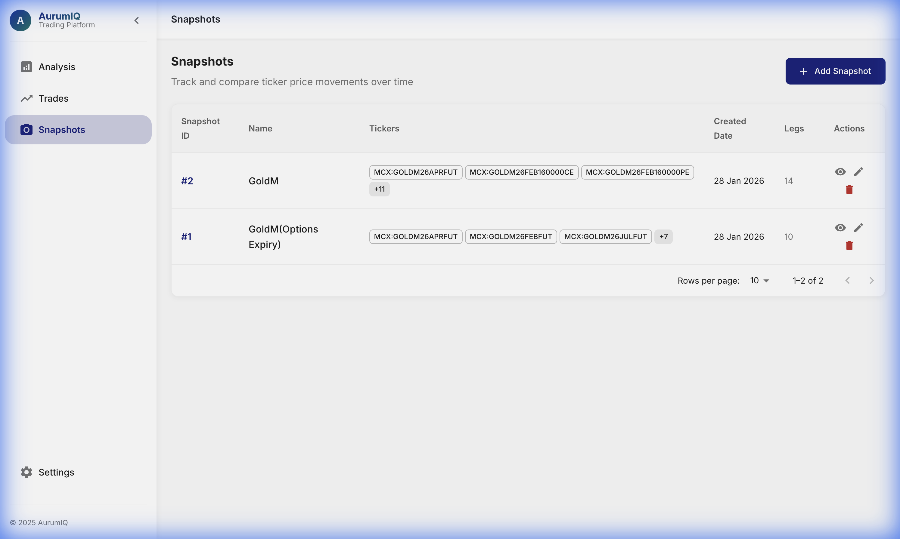

# AurumIQ - Trading & Analysis Platform

A production-ready, institutional-grade trading and analysis web application built with React/MUI frontend and Django REST backend.


## 📸 Screenshots

### Analysis Dashboard

*Real-time portfolio overview with PnL tracking and trade distribution.*

### Trade Management

*comprehensive list of active and closed trades with multi-leg support.*

### Trade Details

*Detailed breakdown of individual trade legs and performance metrics.*

### Market Snapshots

*Capture and compare market states across different timeframes.*

## 🚀 Features

- **Portfolio Analysis Dashboard**
  - Real-time summary cards (Total Trades, PnL stats)
  - Interactive PnL over time chart
  - Trade status distribution (Open vs Closed)

- **Trade Management**
  - Full CRUD operations for trades
  - Multi-leg trade support (spreads, straddles, etc.)
  - Pagination and sorting
  - Detailed trade view with leg breakdown

- **Market Snapshots**
  - Ability to save current market states for specific tickers
  - Track movement (points and percentage) since snapshot date
  - Support for multi-leg snapshot grouping

- **Professional UI/UX**
  - Clean, minimal Material UI design
  - Responsive layout (mobile/tablet/desktop)
  - Smooth animations and transitions
  - Premium color palette with Inter typography

## 🛠 Tech Stack

### Frontend
- **React 18** - UI framework
- **Material UI (MUI) 5** - Component library
- **React Router 6** - Navigation
- **Axios** - HTTP client
- **Recharts** - Charts and visualizations
- **Vite** - Build tool

### Backend
- **Django 4.2** - Web framework
- **Django REST Framework** - API toolkit
- **PostgreSQL** - Database
- **django-cors-headers** - CORS handling

## 📁 Project Structure

```
AurumIQ/
├── backend/                    # Django Backend
│   ├── aurumiq/               # Django Project Config
│   ├── trade/                 # Trades & Analysis App
│   ├── snapshot/              # Market Snapshots App
│   ├── brokers/               # Broker Integrations (Fyers)
│   ├── common/                # Shared logic and models
│   └── manage.py
│
├── frontend/                   # React Frontend
│   ├── src/
│   │   ├── components/        # Reusable Components
│   │   ├── pages/             # Page Components (Analysis, Trades, etc.)
│   │   ├── services/          # API Layer
│   │   └── theme/             # MUI Theme
│   └── vite.config.js
│
└── README.md
```

## 🚦 Prerequisites

- **Python 3.10+**
- **Node.js 18+**
- **PostgreSQL 14+**

## ⚙️ Setup Instructions

### 1. Database Setup
Create a PostgreSQL database named `aurumiq`.

### 2. Backend Setup
```bash
cd backend
python -m venv venv
source venv/bin/activate
pip install -r requirements.txt
cp .env.example .env  # Configure your DB and Fyers keys
python manage.py migrate
python manage.py seed_indian_data  # Optional: Seed with NSE/MCX data
python manage.py runserver
```

### 3. Frontend Setup
```bash
cd frontend
npm install
npm run dev
```

## 📝 Environment Variables

### Backend (.env)
Create a `.env` file in the `backend/` directory and configure the following:

```env
# Django Settings
DJANGO_SECRET_KEY=your-secret-key-here
DEBUG=True
ALLOWED_HOSTS=localhost,127.0.0.1,.vercel.app,.onrender.com

# Database Configuration
USE_LOCAL_DB=True  # Set to False to use PostgreSQL
DATABASE_URL='postgresql://your-db-url'

# Broker Integration (Fyers)
FYERS_CLIENT_ID=your_fyers_client_id
FYERS_SECRET_KEY=your_fyers_secret_key
FYERS_REDIRECT_URI=https://kite.zerodha.com/markets

# Deployment/CORS
CORS_ALLOWED_ORIGINS=http://localhost:5173,http://127.0.0.1:5173,http://localhost:3000
VITE_API_URL=http://127.0.0.1:8000
```

## 🔒 Security Notes
- **Environment Variables**: Use `.env` files for all sensitive credentials. Never commit `.env` to version control.
- **Production Readiness**: Set `DEBUG=False` and use a strong `SECRET_KEY` in production.
- **Data Privacy**: Screenshots in this documentation use mocked data for demonstration purposes.

---
Built with ❤️ for traders who demand professional-grade tools.
